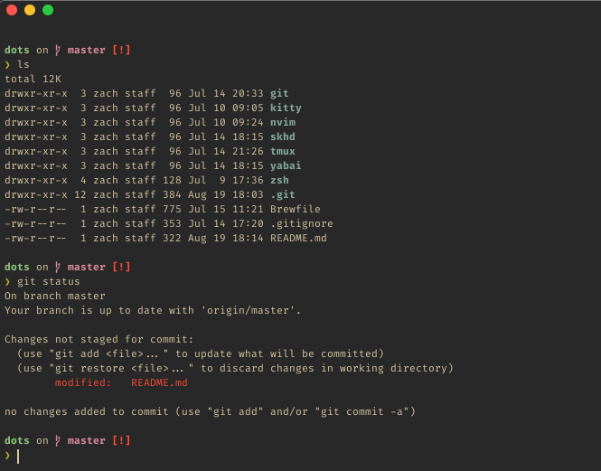

# Zach's Dotfiles



## Installation
** NOTE ** : Before installing these dotfiles, look through this repository and 
keep in mind that these dotfiles are used on a macOS system and may not work 
properly on a Linux on Windows system.

# Cloning the Repository
This repository can be cloned in any directory on your machine.

```bash
git clone https://github.com/zachbedewi/dots.git
```

### Installing Dependencies
To install of the dependencies that are used in this dotfile configuration
(along with some other useful programs), use the command

```bash
brew bundle
```

### Using GNU Stow
These dotfiles are deployed using [GNU Stow](https://www.gnu.org/software/stow/), 
which allows each "package" to be installed separately. For example, in order to
install the zsh package, enter this command while in the dots directory

```bash
stow -t ~ zsh
```

This command will create a symlink between the zsh configuration files in the
dots repo and in the corresponding configuration folder specified by the XDG
Base Directory.
